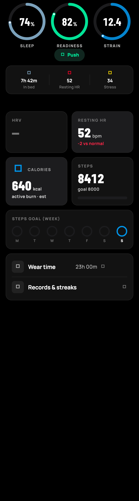
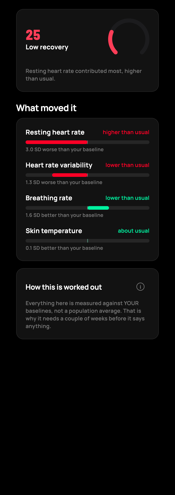
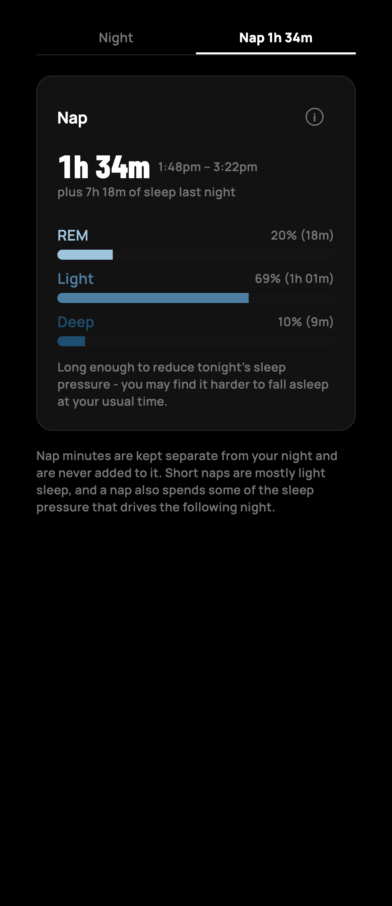

<div align="center">


# Whoop

**A WHOOP 4.0 band that works without the subscription — and knows what you lifted.**

A personal fork of [**OpenStrap Edge**](https://github.com/OpenStrap/edge) that adds
resistance training, nutrition, calendar, weather and prayer times to on-device health
analytics, then lets an AI coach reason across all of it.

[](#testing)
[](#why-flutter-is-pinned)
[](LICENSE)
[](https://github.com/OpenStrap/edge)

*Not affiliated with WHOOP. Your health data never leaves your phone.*

</div>

---

## What this is

WHOOP sells a good sensor attached to a mandatory subscription. When the subscription
lapses the hardware goes dark — you own it, and it stops working.

[OpenStrap Edge](https://github.com/OpenStrap/edge) already solved the hard part: it
talks to the band over Bluetooth, decodes the protocol, and computes sleep, recovery,
HRV and strain entirely on your phone. **All of that is upstream's work, and it is
excellent.**

This fork exists for the last 10%. Upstream knows you did *something* strenuous. It has
no idea you squatted 140 kg for five, that you ate 90 g of protein, that it was 34 °C
outside, or that you had six back-to-back meetings. **Those are the things that actually
explain a bad recovery score**, and none of them are visible from the wrist.

> **"Am I recovered enough to go heavy on deadlifts today?"**
>
> **"Does my protein intake actually move my recovery?"**
>
> Neither is answerable from a wrist sensor alone. That is why this fork exists.

---

## Screens

| Today | Readiness breakdown | Naps |
|:--:|:--:|:--:|
|  |  |  |
| Sleep, readiness and strain against *your* baselines | Every input, signed, with the z-score behind it | Daytime sleep, kept separate from the night |

*Rendered by the golden harness in [`test/ui_render_test.dart`](test/ui_render_test.dart)
— real frames from the real widgets, not mockups.*

---

## What this fork adds

Everything below is additive. None of it exists upstream.

### Training and body composition

| Feature | What it does |
|---|---|
| **Hevy sync** | Every set: exercise, load, reps, RPE. Works **without Hevy Pro**. |
| **Strength analysis** | Estimated 1RM (Epley/Brzycki, RPE-corrected via reps-in-reserve), per-lift progression by Theil-Sen slope, weekly sets per muscle graded against Schoenfeld 2017. |
| **Overreaching detector** | Flags functional overreaching from performance **plus** HRV and resting HR. Performance is the defining criterion, not a bonus signal. |
| **Bulk quality** | Gaining muscle, or just gaining? Weight trend against strength trend. Abstains when strength is unknown rather than guessing. |
| **HR rest timer** | Rest until your heart rate actually comes back down (40% of heart-rate reserve), not until an arbitrary clock expires. |

### Context the wrist cannot see

| Feature | Source |
|---|---|
| **Nutrition** | Apple Health — protein, calories, carbs, fat, water |
| **Weather** | Open-Meteo. Heat and humidity measurably move HRV |
| **Calendar** | EventKit — counts and busy minutes only, never event contents |
| **Caffeine** | Logged intake, 5-hour half-life model, "last safe coffee" time |

### Sleep

- **Composite sleep score** blending duration, efficiency, timing and debt
- **Naps** detected and reported **separately** from the night, never summed into it
- **Cardiopulmonary coupling** (Thomas 2005) surfaced as sleep stability
- Honest treatment of deep sleep — [see the methodology](docs/METHODOLOGY.md#deep-sleep)

### Life

- **Prayer times** from geolocation, with repeat reminders until marked done
- **Ramadan mode** — fasted days are excluded from correlations rather than silently confounding them
- **Band + phone alarms** firing simultaneously, surviving Do Not Disturb
- **Google Drive backup** so the database survives deleting the app

### The coach

Bring-your-own-key and OpenAI-compatible, pointed at Gemini's free tier. It runs
read-only SQL over allow-listed views. **The key never leaves the device**, and a
fail-closed request-size guard means a runaway tool loop cannot ship your health
database anywhere.

---

## Quick start

**Not a developer?** → [**docs/SETUP.md**](docs/SETUP.md) assumes no terminal knowledge.

**Building it yourself:**

```bash
# Flutter is PINNED — see "Why Flutter is pinned" below.
fvm install && fvm flutter pub get

cp .env.example .env                                     # add your Gemini key
cp ios/Config/Signing.xcconfig.example ios/Config/Signing.xcconfig

fvm flutter test                                         # 1075 tests
fvm flutter build ios --release --dart-define-from-file=.env
```

Install to a connected iPhone:

```bash
xcrun devicectl device install app --device <UDID> build/ios/iphoneos/Runner.app
```

> [!WARNING]
> Use `devicectl`, **not** `fvm flutter install`. The latter uninstalls first and
> **wipes the database** — every synced night, every logged lift. `devicectl` performs
> an upgrade install, so the container survives.

---

## Design principles

These are load-bearing, not decoration. They are why the numbers here can be trusted.

**Abstain over fabricate.** A metric with insufficient data reports absent and says what
it is waiting for. It never substitutes a population average and presents it as yours.
Correlations need 14 paired days, bulk quality needs 10 weigh-ins, readiness needs a
baseline — until then they say so.

**Samples are sacred.** `raw_archive` is never pruned. Every derived table is rebuildable
by bumping `kAlgoVersion`, so a better algorithm can be applied retroactively to data
already collected.

**Colour is data, never decoration.** Green means recovered, blue means exertion, red
means don't. A card tint carrying no information is a card tint that got deleted.

**Uncertainty is shown, not hidden.** Where two independent signals disagree — as the
cardiac and respiratory paths do on deep sleep — the app says so rather than quietly
picking whichever answer looks better.

**Every claim traces to data.** The coach abstains when the data does not support an
answer. No confident invention about your physiology.

---

## Architecture

Upstream enforces a strict three-repo split. This fork respects it, because it is what
keeps merging from upstream tractable.

```
OpenStrap/protocol     bytes      GATT, framing, CRC, opcodes, record decode
OpenStrap/analytics    metrics    HRV, sleep staging, readiness, strain, correlations
OpenStrap/edge         flows      BLE link management, storage, UI        ← you are here
```

A new metric goes in `analytics`. A new screen, flow or table goes in `edge`. A metric
implemented inside `edge/lib/compute` is in the wrong place unless it is pure
orchestration.

Full detail: [**docs/ARCHITECTURE.md**](docs/ARCHITECTURE.md).

---

## Testing

```bash
fvm flutter test                        # edge:      1075 tests
cd ../analytics && fvm dart test        # analytics:  476 tests
```

Anything touching stored data gets a migration test. Anything computing a health number
gets a test pinning the **method**, not merely the output — including tests that assert
what the code deliberately refuses to claim.

The UI has a golden harness that writes real PNGs, so a design can be looked at instead
of argued about:

```bash
fvm flutter test test/ui_render_test.dart --update-goldens --run-skipped
```

---

## Why Flutter is pinned

`3.41.6`, via FVM, deliberately. On 3.44.x this repo **does not compile**:
`phosphor_flutter` declares `class PhosphorIconData extends IconData`, and `IconData`
became a `final class`. The symptom is ~22 test files failing at *load* while the logic
tests still pass — which looks like a test bug and is not.

Sibling packages are pinned to **commit SHAs, not branch refs**, for the same reason: a
floating ref lets an upstream commit silently change the behaviour of an already
reviewed build.

Run everything through `fvm flutter`, never bare `flutter`.

---

## Privacy

- Health data lives **on the phone**, in local SQLite. There is no backend.
- The AI coach is bring-your-own-key. The key sits in the platform keychain and is sent
  only to the provider you configure.
- Calendar access reads **counts and busy minutes only** — never titles, attendees or
  locations.
- Google Drive backup is opt-in, uses the non-sensitive `drive.file` scope, and can only
  see files this app itself created.

See [PRIVACY.md](PRIVACY.md).

---

## Credit

**This fork is overwhelmingly [OpenStrap](https://github.com/OpenStrap) code.** The BLE
engine, protocol decode, sleep staging, HRV analysis and the entire on-device pipeline
are upstream's work, MIT licensed. The protocol reverse engineering behind it represents
an enormous amount of careful effort by people who then gave it away for free.

If you find this useful, [star upstream](https://github.com/OpenStrap/edge) — that is
where the hard part lives. Upstream's own README is preserved at
[docs/README.upstream.md](docs/README.upstream.md).

---

## Licence and scope

MIT, inherited from upstream. See [LICENSE](LICENSE) and [NOTICE.md](NOTICE.md).

> [!NOTE]
> This is a personal fork built for one person and one band. It is not a product, has no
> roadmap and makes no support promises. Nothing here is a medical device — every number
> is a wrist-sensor estimate, not a diagnosis. See
> [docs/METHODOLOGY.md](docs/METHODOLOGY.md) for what each figure can and cannot support.
